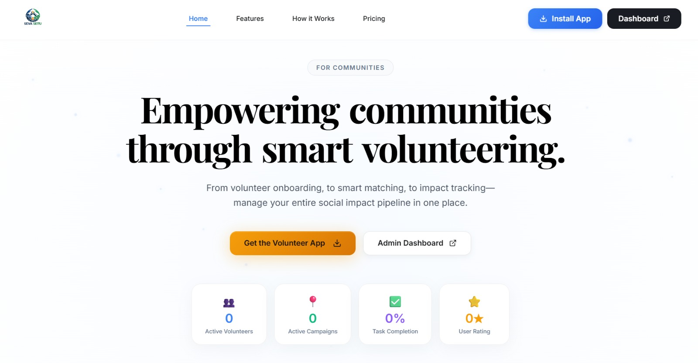

<div align="center">


# 🙏 SevaSetu

### Smart Disaster Response & Volunteer Coordination Platform

[](https://python.org)
[](https://fastapi.tiangolo.com)
[](https://reactjs.org)
[](https://vitejs.dev)
[](https://sqlite.org)
[](https://github.com/DakshBhavsar007/SevaSetu)

> A full-stack, real-time platform that bridges **NGOs, admins, and volunteers** during disasters — with AI-powered matching, live maps, OCR scanning, and weather-based alerts.

<br>


</div>

---

## ✨ What is SevaSetu?

**SevaSetu** (सेवासेतु — *Bridge of Service*) is a smart disaster relief coordination system built for rapid deployment during emergencies.

It provides:
- A **React Admin Dashboard** for NGO coordinators to manage needs, volunteers, and resources
- A **Mobile-first Volunteer App** for field workers to view tasks, report needs, and track their assignments
- A **FastAPI Backend** powering all data, authentication, matching, and integrations
- A **Landing Page** as the public entry point

---

## 🗂️ Project Structure

```
SevaSetu/
├── .env                        ← Single config file (all secrets live here)
├── .env.example                ← Template — safe to commit
├── LOGO.png
├── render.yaml                 ← Deployment config (Render.com)
│
├── backend/                    ← Python FastAPI REST API
│   ├── app/
│   │   ├── main.py             ← App entry point
│   │   ├── config.py           ← Pydantic settings (reads ../.env)
│   │   ├── models.py           ← SQLAlchemy ORM models
│   │   ├── schemas.py          ← Request/Response schemas
│   │   ├── routes/             ← auth · needs · volunteers · matching
│   │   ├── middleware/         ← JWT auth · role-based access control
│   │   └── services/           ← Matching engine · OCR · Geocoding
│   ├── seed_data.py            ← Populate DB with demo data
│   └── requirements.txt
│
├── admin-dashboard/            ← React admin panel (Vite)
│   └── src/
│       ├── pages/              ← Dashboard · Map · Needs · Volunteers
│       ├── components/         ← Layout · DisasterAlertSystem
│       └── services/           ← API service layer
│
├── volunteer-app/              ← React mobile-first volunteer app (Vite)
│   └── src/
│       ├── pages/              ← Home · Tasks · Map · Report · Profile · Login
│       └── services/           ← API service layer
│
└── landing_page/               ← Public-facing landing page
```

---

## 🚀 Features

### 🛠️ Admin Dashboard
| Feature | Description |
|---|---|
| 📊 Impact Dashboard | Real-time stats, charts, exportable PDF reports |
| 📋 Need Tracker | Full CRUD for community needs with urgency prioritization |
| 🗺️ Live Map | Leaflet.js map — need markers + volunteer positions in real-time |
| 👥 Volunteer Management | View, filter, and manage volunteer profiles & availability |
| 🧠 Smart Matching | AI-powered algorithm to match volunteers to needs by skill & location |
| 📷 OCR Scanner | Upload an image → Gemini AI auto-extracts need data |
| 📡 Broadcast | Push announcements to all active volunteers instantly |
| ⚠️ Weather Alerts | Real-time disaster detection via OpenWeatherMap API |
| 🌗 Dark / Light Mode | Full theme toggle |

### 📱 Volunteer App (Mobile-First)
| Page | Description |
|---|---|
| 🏠 Home | Stats overview, active tasks, quick action shortcuts |
| 📋 Tasks | View and accept assigned tasks |
| 🗺️ Map | See all nearby needs pinned on an interactive map |
| 📝 Report | Submit new community needs from the field |
| 👤 Profile | Manage skills, availability window, and location |
| 🔐 Auth | Email/Password signup or one-click Google Sign-In |

---

## ⚡ Quick Start

### Prerequisites

- **Python 3.8+** with `pip`
- **Node.js 18+** with `npm`

---

### Step 1 — Clone & Configure

```bash
git clone https://github.com/DakshBhavsar007/SevaSetu.git
cd SevaSetu

cp .env.example .env
```

Open `.env` and fill in your keys:

| Key | Where to get it |
|---|---|
| `SECRET_KEY` | Any random secret string |
| `GOOGLE_CLIENT_ID` | [Google Cloud Console](https://console.cloud.google.com) |
| `GEMINI_API_KEY` | [Google AI Studio](https://aistudio.google.com/app/apikey) |
| `OWM_API_KEY` | [OpenWeatherMap](https://openweathermap.org/api) |

---

### Step 2 — Backend

```bash
cd backend

# Create & activate virtual environment
python -m venv venv
venv\Scripts\activate        # Windows
# source venv/bin/activate   # Mac / Linux

# Install dependencies
pip install -r requirements.txt

# Seed the database with demo data
python seed_data.py

# Start the server
python -m uvicorn app.main:app --reload --port 8000
```

| Endpoint | URL |
|---|---|
| REST API | http://localhost:8000 |
| Swagger Docs | http://localhost:8000/docs |

---

### Step 3 — Admin Dashboard

```bash
# New terminal
cd admin-dashboard

npm install
npm run dev
```

> Opens at **http://localhost:5173** — No login required (auto-login for admin).

---

### Step 4 — Volunteer App

```bash
# New terminal
cd volunteer-app

npm install
npm run dev
```

> Opens at **http://localhost:5174** — Signup or login required.

---

### Step 5 — Landing Page *(optional)*

```bash
cd landing_page
# Open index.html directly in browser, or serve with any static server
```

---

## 🔐 Authentication

| Method | Volunteer App | Admin Dashboard |
|---|---|---|
| Email / Password | ✅ Signup + Login | ❌ Auto-login |
| Google OAuth 2.0 | ✅ One-click Sign-In | ❌ Auto-login |
| Dev Token (testing) | ✅ | ✅ |

- Passwords hashed with **bcrypt**
- Sessions use **JWT tokens** with 24-hour expiry
- All API routes protected via Bearer token middleware

---

## ⚙️ Environment Variables

All config lives in a single `.env` at the project root.

| Variable | Required | Description |
|---|---|---|
| `SECRET_KEY` | ✅ | JWT signing secret |
| `DATABASE_URL` | ✅ | SQLite path — default: `sqlite:///./smartalloc.db` |
| `GOOGLE_CLIENT_ID` | OAuth | Google OAuth client ID |
| `GEMINI_API_KEY` | OCR | Gemini 2.5 Flash API key |
| `OWM_API_KEY` | Alerts | OpenWeatherMap API key |
| `VITE_GOOGLE_CLIENT_ID` | Frontend OAuth | Same as `GOOGLE_CLIENT_ID` |
| `VITE_OWM_API_KEY` | Frontend Alerts | Same as `OWM_API_KEY` |

---

## 🛠️ Tech Stack

| Layer | Technology |
|---|---|
| **Backend** | Python · FastAPI · SQLAlchemy · Pydantic |
| **Database** | SQLite |
| **Frontend** | React 18 · Vite · React Router v6 |
| **Maps** | Leaflet.js |
| **Authentication** | Google OAuth 2.0 · JWT · bcrypt |
| **AI / OCR** | Google Gemini 2.5 Flash |
| **Weather** | OpenWeatherMap API |
| **Styling** | Vanilla CSS · Glassmorphic Design |
| **Deployment** | Render.com (`render.yaml`) |

---

## 🧠 Architecture Overview

```
                     ┌────────────────┐
                     │  Landing Page  │
                     └───────┬────────┘
                             │
              ┌──────────────┼──────────────┐
              │                             │
   ┌──────────▼──────────┐     ┌────────────▼───────────┐
   │   Admin Dashboard   │     │     Volunteer App       │
   │  (React · Port 5173)│     │  (React · Port 5174)   │
   └──────────┬──────────┘     └────────────┬───────────┘
              │                             │
              └──────────────┬──────────────┘
                             │ REST API (JWT)
                   ┌─────────▼──────────┐
                   │  FastAPI Backend   │
                   │   (Port 8000)      │
                   └────┬──────┬────────┘
                        │      │
               ┌────────▼─┐  ┌─▼─────────────┐
               │  SQLite  │  │ External APIs  │
               │    DB    │  │ Gemini · OWM   │
               └──────────┘  └───────────────┘
```

---


## 📄 License

This project was built for **Smart India Hackathon** purposes.  
© 2024 SevaSetu Team — All rights reserved.

---

<div align="center">

Made with ❤️ to serve communities in need.

**⭐ Star this repo if it helped you!**

</div>